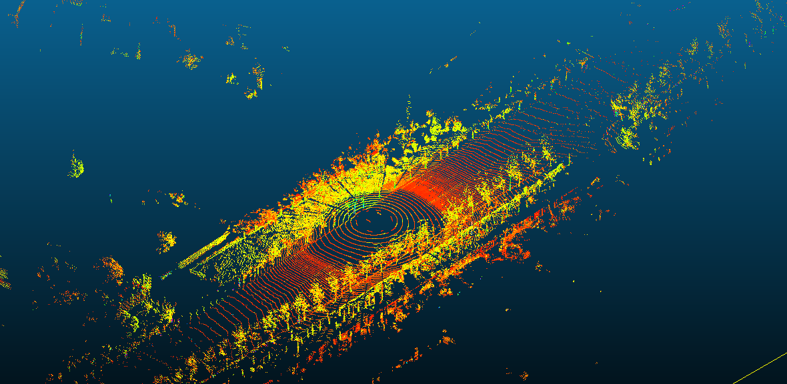

curb detection short result demo:

our paper will be update:TODO.

NRS-Dataset:

Overall:

The dataset include: 40000+ frames pointclouds and 6000+ labels.

Our NRS-Datasets can be download at: https://pan.baidu.com/s/1OoPrI-5ltRns0Omrp-BIsw?pwd=3udc extract coder: 3udc

Details:
The NRS-dataset contains around 6 thousand point cloud frames labeled. The ratio of day-scenario and night-scenario is 3.5 : 2.5. The data is gathered by RS-Ruby {https://www.robosense.ai/en/rslidar/RS-Ruby} from both city roads in Shenyang and campus roads at the company 
NEUSOFT REACHAUTO {https://www.reachauto.com/en/}.
The origin point cloud with 46000+ points at each frame are collected by our autonomous driving car. And the front-view camera with space-time synchronization with our LiDAR will synchronously capture the corresponding scene semantic information. We set the region of interest (ROI) to 
[-22.4m, 22.4m] in $x_{axis}$ and [0m, 44.8m] in $y_{axis}$, where $y_{axis}$ towards the driving direction. We labeled the curbs by projecting the point clouds into BEV images then highlighting the image pixels containing curbs with Labelme tools. As a side note, to the best of our knowledge, the 128-line curb dataset almost the first 128-line LiDAR point 
clouds dataset for curb detection and this paper is the first attempt to evaluate a curb detection algorithm based on DNN architecture using a 128-line LiDAR on autonomous driving vehicle.

This dataset is labeled for 3D curb detection. For example, figure 1 is an origin pointcloud. 

<!--  -->

Then, we transfomer the pointcloud to BEV presention, as figure 2.

Next, we extract curb information and build the ground truth from curb information in the BEV representations. Here, we use the labelme tool to label curb line.

If you have any question, please contact: jgaomai@mail.ustc.edu.cn
